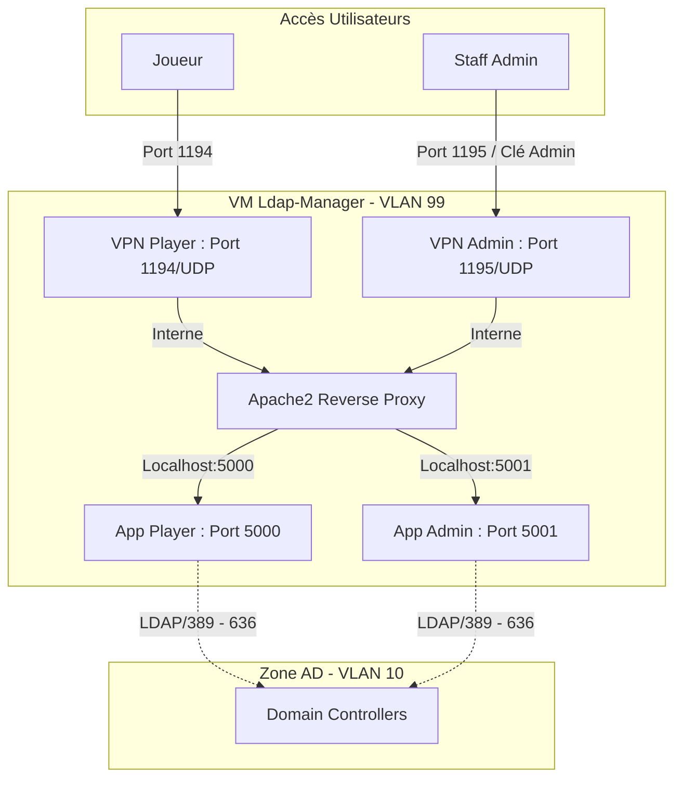

# 404CTF — Gestionnaire LDAP

Application de gestion des comptes Active Directory pour le 404CTF, avec deux interfaces distinctes.

## Architecture

```
404ctf-ldap-manager/
├── shared/                  # Module Python partagé (logique métier)
│   ├── ldap_core.py         # Fonctions LDAP/AD, validation CTFd
│   ├── config_manager.py    # CRUD challenge_config.json
│   └── log_manager.py       # Gestion CSV + logs
│
├── player/                  # Interface joueurs (port 5000)
│   ├── app.py
│   └── templates/           # 5 templates (base, index, form, success, error)
│
├── admin/                   # Interface administration (port 5001)
│   ├── app.py
│   └── templates/           # 7 templates (base, login, dashboard, accounts, logs, config, config_edit)
│
├── Dockerfile.player        # Image Player
├── Dockerfile.admin         # Image Admin
├── docker-compose.yml       # 2 services + volume partagé
├── deploy.sh                # Script de déploiement
├── challenge_config.json    # Configuration des challenges
└── requirements.txt         # Dépendances Python
```

## Interfaces

### Player (port 5000)
Interface pour les joueurs du CTF :
- Liste des challenges disponibles
- Formulaire de création de compte AD (avec validation token CTFd)
- Affichage des identifiants générés

### Admin (port 5001)
Interface pour le staff :
- **Dashboard** : statistiques en temps réel (comptes créés, challenges actifs)
- **Comptes** : tableau live des comptes créés, recherche, export CSV
- **Logs** : viewer de logs style terminal avec filtrage par niveau, auto-refresh
- **Configuration** : CRUD complet sur les challenges (ajout, modification, suppression)

## Déploiement rapide

```bash
# Mode debug complet (CTFd + LDAP simulés)
./deploy.sh --debug-ctfd --debug-ldap

# Production avec mot de passe admin personnalisé
./deploy.sh --production --admin-password MonMotDePasse!

# Ports personnalisés
./deploy.sh --production --player-port 8080 --admin-port 8081
```

### Options du script deploy.sh

| Option | Description | Défaut |
|--------|-------------|--------|
| `--debug-ctfd` | Simule la validation CTFd | désactivé |
| `--debug-ldap` | Simule les opérations LDAP | désactivé |
| `--ctfd-url URL` | URL de CTFd | https://ctf.404ctf.fr |
| `--production` | Mode production | développement |
| `--player-port PORT` | Port Player | 5000 |
| `--admin-port PORT` | Port Admin | 5001 |
| `--admin-password PWD` | Mot de passe admin | admin404 |
| `--log-level LEVEL` | Niveau de log | INFO |
| `--reset-csv` | Réinitialise le CSV | non |
| `--show-logs` | Affiche les logs après démarrage | non |

## Déploiement manuel

```bash
# Build des images
docker compose build

# Démarrage
ADMIN_PASSWORD=MonMotDePasse docker compose up -d

# Logs
docker compose logs -f player
docker compose logs -f admin

# Arrêt
docker compose down
```


## Variables d'environnement

| Variable | Description | Défaut |
|----------|-------------|--------|
| `ADMIN_PASSWORD` | Mot de passe interface admin | admin404 |
| `CTFD_URL` | URL du serveur CTFd | https://ctf.404ctf.fr |
| `DEBUG_CTFD` | Mode debug CTFd | False |
| `DEBUG_LDAP` | Mode debug LDAP | False |
| `CONFIG_FILE` | Fichier de configuration | challenge_config.json |
| `LOG_LEVEL` | Niveau de log | INFO |
| `ACCOUNTS_LOG_FILE` | Fichier CSV des comptes | /app/data/accounts.csv |
| `API_LOG_FILE` | Fichier de log API | /app/data/api.log |

## Configuration des challenges

Le fichier `challenge_config.json` est gérable directement via l'interface Admin. Format :

```json
{
  "global_config": {
    "domain": "ctfcorp.local",
    "admin_user": "CTFCORP\\formation",
    "admin_password": "..."
  },
  "challenges": [
    {
      "challenge_name": "Example",
      "description": "...",
      "ou": "CN=Users,DC=ctfcorp,DC=local",
      "groups": ["CTF_Player"],
      "ldap_config": { "server": "...", "domain": "...", "admin_user": "...", "admin_password": "..." },
      "account_options": { "user_cannot_change_password": true, "password_never_expires": true }
    }
  ]
}
```

## Architecture Réseau

L'application est déployée sur une VM Linux (Ubuntu) isolée, connectée à deux sous-réseaux distincts pour garantir la sécurité des environnements.

### Segments Réseau (VLANs)

| VLAN | Nom | CIDR | Rôle |
|------|-----|------|------|
| **10** | `404ctf-zone-machine-ad` | `10.0.10.0/24` | Zone de travail contenant les machines Active Directory cibles. |
| **99** | `404ctf-zone-admin-ad` | `10.0.99.0/24` | Zone d'hébergement du code (VM Ldap-Manager). |

### Schéma de Déploiement



### Explication Technique

1. **Isolation des Accès** : 
   - L'interface **Player** est accessible via le flux VPN standard des joueurs (port et clé standard).
   - L'interface **Admin** est strictement isolée. Elle n'est accessible que via un profil VPN spécifique ("VPN Admin"), utilisant une clé de chiffrement distincte et exposée sur un port réseau différent pour limiter la surface d'attaque.

2. **Reverse Proxy (Apache2)** :
   - Le serveur Apache2 agit comme point d'entrée unique. Il gère la terminaison SSL (si configurée) et route les requêtes vers les conteneurs Docker appropriés via `ProxyPass`.

3. **Flux AD (VLAN Inter-Zone)** :
   - La VM de déploiement (VLAN 99) possède les autorisations nécessaires pour communiquer avec le VLAN 10 uniquement pour les protocoles LDAP/LDAPS et Kerberos, permettant ainsi la gestion dynamique des comptes AD sans exposer les serveurs AD directement sur le réseau joueur.
