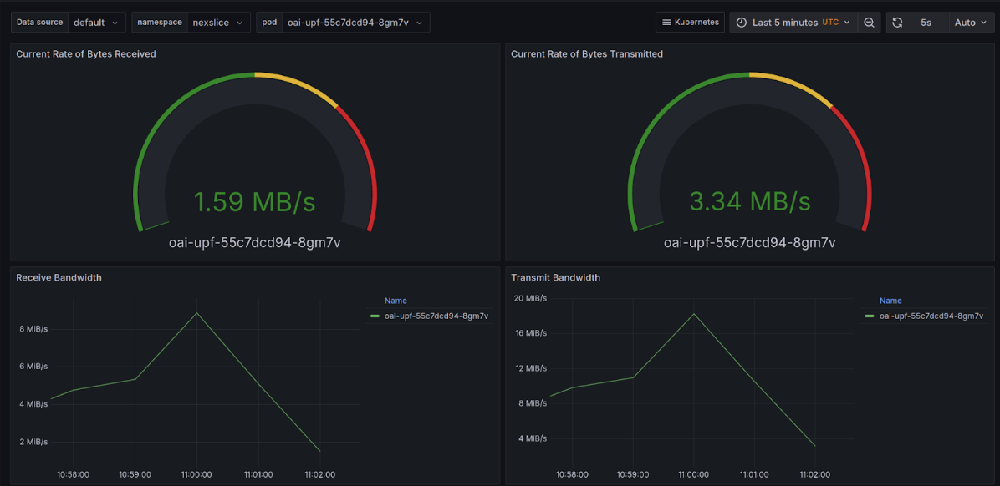
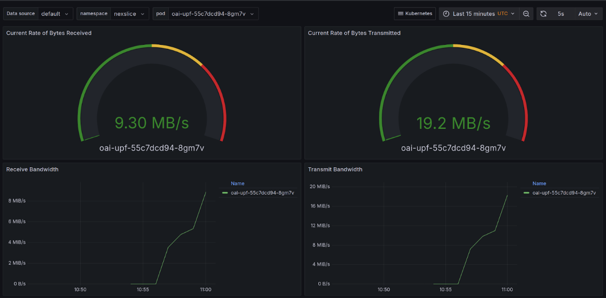
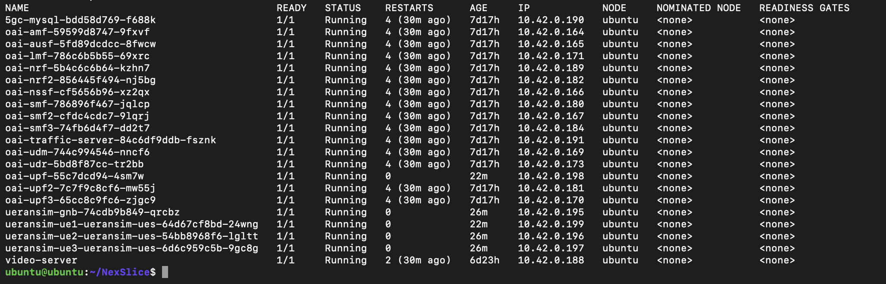
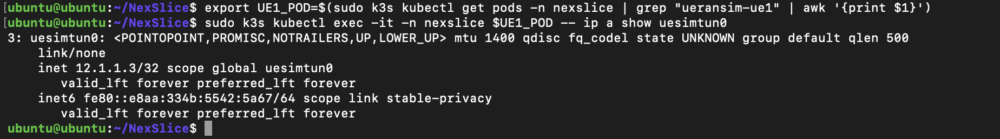
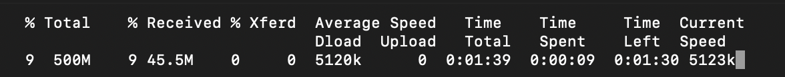

# Validation du Slice 5G eMBB (NexSlice)

## Introduction

Ce projet vise à valider la capacité d’un slice 5G de type **eMBB (Enhanced Mobile Broadband)** à supporter un trafic vidéo lourd simulant un usage réel (streaming HD / 4K).
L’ensemble de l’architecture s’appuie sur un déploiement **Cloud-Native Kubernetes**, avec les fonctions 5G OAI, un UE simulé UERANSIM et un serveur vidéo dédié.

Les tests ont été réalisés afin de mesurer :

* La stabilité du débit sous contrainte (QoS à 5 Mbps)
* Le comportement en mode *Best Effort* (débit maximal)
* La corrélation des mesures via Grafana sur l’UPF
* La capacité du chemin utilisateur (User Plane 5G) à transporter un flux vidéo continu

---

# 1. Contexte

## 1.1 Objectif et choix techniques

L'objectif de cette phase était de valider la capacité du slice eMBB (Enhanced Mobile Broadband) à supporter un flux applicatif lourd, simulant un usage réel de type "Streaming Vidéo HD/4K".

Compte tenu de l'environnement d'exécution du projet (Architecture Headless / VM sans interface graphique), nous avons opté pour une approche "Cloud-Native" simulant un streaming HTTP (Progressive Download), technologie utilisée par les plateformes de VOD actuelles (Netflix, YouTube).

Au lieu de lancer une interface VLC graphique (incompatible avec l'environnement), nous avons mis en place l'architecture suivante :

* **Serveur de Contenu (Content Provider)** : Déploiement d'un pod nginx hébergeant un fichier vidéo haute définition simulé (500 Mo).
* **Client (UE)** : Utilisation de l'outil curl configuré pour simuler un lecteur vidéo, avec forçage du routage via l'interface 5G.

---

## 1.2 Architecture déployée

J'ai procédé au déploiement des services applicatifs directement dans le cluster Kubernetes, aux côtés des fonctions réseau 5G.

On observe dans l’état des pods :

* Les fonctions du cœur 5G (AMF, SMF, UPF...) en statut Running.
* Le pod client **ueransim-ue1** (l'utilisateur simulé).
* Le pod **video-server** que j’ai déployé pour héberger le contenu.

`

---

## 1.3 Réalisation des tests et résultats

### Scénario A : Simulation d’un Flux Streaming Régulé (QoS)

Pour ce premier test, j’ai limité le débit à **5 Mo/s (40 Mbps)**.

Observations :

* **UE** : `curl --limit-rate 5M` montre un débit parfaitement stable (5120k).
* **Grafana** : augmentation nette du trafic UPF, confirmant que le flux vidéo transite bien par le plan utilisateur 5G.

`

### Scénario B : Test de Capacité Maximale (Sans Limite)

En supprimant la limitation :

* **UE** : téléchargement à 12.6 Mo/s (~100 Mbps)
* **Grafana** : pic à 19.2 MB/s sur l’UPF

📷 *Image ici*


---

## 1.4 Conclusion

L'expérimentation valide fonctionnellement le cas d'usage eMBB.

* Débit garanti de 40 Mbps sans jitter pour du streaming 4K
* Débit maximal constaté ≈ 100 Mbps
* UPF correctement dimensionné et observé en charge réelle via Grafana

---

# 2. Commandes utilisées

## 2.1 Infrastructure complète

```bash
sudo k3s kubectl get pods -n nexslice -o wide
```


---

## 2.2 Test connectivité

```bash
export UE1_POD=$(sudo k3s kubectl get pods -n nexslice | grep "ueransim-ue1" | awk '{print $1}')
clear
sudo k3s kubectl exec -it -n nexslice $UE1_POD -- ip a show uesimtun0
```


---

## 2.3 Test QoS streaming

### Variables

```bash
export UE1_POD=$(sudo k3s kubectl get pods -n nexslice | grep "ueransim-ue1" | awk '{print $1}')
export VIDEO_IP=$(sudo k3s kubectl get pod video-server -n nexslice -o jsonpath='{.status.podIP}')
```

### Streaming bridé (5 Mbps)

```bash
sudo k3s kubectl exec -it -n nexslice $UE1_POD -- curl --interface uesimtun0 http://$video_ip/movie.mp4 -o /dev/null --limit-rate 5M
```


---

# 3. YAML du Serveur Vidéo

```yaml
apiVersion: v1
kind: Pod
metadata:
  name: video-server
  namespace: nexslice
  labels:
    app: video-server
spec:
  containers:
    - name: nginx-streamer
      image: nginx:alpine
      ports:
        - containerPort: 80
      resources:
        limits:
          memory: "256Mi"
          cpu: "500m"
      lifecycle:
        postStart:
          exec:
            command:
              [
                "/bin/sh",
                "-c",
                "echo 'Génération du fichier vidéo HD...'; dd if=/dev/zero of=/usr/share/nginx/html/movie.mp4 bs=1M count=500; echo 'Vidéo prête.'"
              ]
```

---

# 4.1 Script automatisé de test

```bash
#!/bin/bash

echo "=================================================="
echo "   TEST COMPLET NEXSLICE : REALISTE + MAX SPEED"
echo "=================================================="

# 1. Récupération automatique
echo "[INIT] Recherche des composants..."
UE_POD=$(sudo k3s kubectl get pods -n nexslice | grep "ueransim-ue1" | awk '{print $1}')
VIDEO_IP=$(sudo k3s kubectl get pod video-server -n nexslice -o jsonpath='{.status.podIP}')

if [ -z "$UE_POD" ] || [ -z "$VIDEO_IP" ]; then
    echo "ERREUR : UE ou Serveur introuvable."
    exit 1
fi
echo "      -> UE: $UE_POD | Serveur: $VIDEO_IP"
echo "--------------------------------------------------"

# --- TEST 1 : STREAMING RÉALISTE (QoS) ---
echo ""
echo "[TEST 1/2] Simulation Streaming 4K (Limité à 5MB/s - 40Mbps)"
echo "      -> Durée étendue à 60s pour bien voir le plateau Grafana..."

# On laisse tourner 60 secondes pour bien stabiliser le graphique
sudo k3s kubectl exec -it -n nexslice $UE_POD -- curl --interface uesimtun0 http://$VIDEO_IP/movie.mp4 -o /dev/null --limit-rate 5M --max-time 60

echo ""
echo "--------------------------------------------------"
echo "   PAUSE (5 secondes) - Regardez Grafana redescendre"
echo "--------------------------------------------------"
sleep 5

# --- TEST 2 : CAPACITÉ MAXIMALE (eMBB) ---
echo ""
echo "[TEST 2/2] Test de Capacité Max (eMBB - Sans limite)"
echo "      -> Téléchargement complet du fichier (500Mo)..."
# Pas de limite de temps : on télécharge tout jusqu'à la fin
sudo k3s kubectl exec -it -n nexslice $UE_POD -- curl --interface uesimtun0 http://$VIDEO_IP/movie.mp4 -o /dev/null

echo ""
echo "=================================================="
echo "   DÉMO TERMINÉE AVEC SUCCÈS"
echo "=================================================="

---
```

# 🤖 4.2 Scipt d'application de la QoS sur l'UPF

```bash
#!/usr/bin/env bash
set -e

# Namespace du core 5G + slices
NS=nexslice

# Slice de UE1 → UPF = oai-upf
SLICE_ID=1

# Interface N6 dans l’UPF (à adapter si besoin)
N6_IF="net2"

# Débit max : 5 MB/s ≃ 40 Mbit/s
RATE="40mbit"

############################################
# 1) Détection du pod UE1
############################################
echo "[INIT] Détection de l'UE1..."
UE_POD=$(sudo k3s kubectl get pods -n "$NS" \
  -o name | grep "ueransim-ue1" | head -n1 | cut -d'/' -f2)

if [ -z "$UE_POD" ]; then
  echo "[ERREUR] ue1 introuvable."
  exit 1
fi

echo "[INFO] UE1 : $UE_POD"

############################################
# 2) Détection du pod video-server
############################################
VIDEO_POD=$(sudo k3s kubectl get pods -n "$NS" \
  -o name | grep "video-server" | head -n1 | cut -d'/' -f2)

if [ -z "$VIDEO_POD" ]; then
  echo "[ERREUR] video-server introuvable."
  exit 1
fi

VIDEO_IP=$(sudo k3s kubectl get pod "$VIDEO_POD" -n "$NS" \
  -o jsonpath='{.status.podIP}')

echo "[INFO] Video-server : $VIDEO_POD ($VIDEO_IP)"

############################################
# 3) Détection de l’UPF de la slice
############################################
UPF_BASENAME="oai-upf"

UPF_POD=$(sudo k3s kubectl get pods -n "$NS" \
  -o name | grep "$UPF_BASENAME" | head -n1 | cut -d'/' -f2)

if [ -z "$UPF_POD" ]; then
  echo "[ERREUR] UPF introuvable."
  exit 1
fi

echo "[INFO] UPF : $UPF_POD"

############################################
# 4) Vérification → QoS déjà appliquée ?
############################################
HAS_QDISC=$(sudo k3s kubectl exec -n "$NS" "$UPF_POD" -- \
  bash -c "tc qdisc show dev $N6_IF | grep -c 'htb 1:' || true")

############################################
# 5) Si oui → suppression de la QoS
############################################
if [ "$HAS_QDISC" != "0" ]; then
  echo "[QOS] Déjà appliquée → suppression..."
  sudo k3s kubectl exec -n "$NS" "$UPF_POD" -- bash -c "
    tc qdisc del dev $N6_IF root 2>/dev/null || true
  "
  echo "[DONE] QoS désactivée."
  exit 0
fi

############################################
# 6) Sinon → application de la limite
############################################
echo "[QOS] Application de la limite $RATE..."

sudo k3s kubectl exec -n "$NS" "$UPF_POD" -- bash -c "
  tc qdisc add dev $N6_IF root handle 1: htb default 10
  tc class add dev $N6_IF parent 1: classid 1:10 htb rate $RATE ceil $RATE
  tc filter add dev $N6_IF protocol ip parent 1:0 prio 1 u32 match ip dst $VIDEO_IP/32 flowid 1:10
  tc filter add dev $N6_IF protocol ip parent 1:0 prio 1 u32 match ip src $VIDEO_IP/32 flowid 1:10
"

echo "[DONE] QoS activée : $RATE vers/depuis $VIDEO_IP"

---
```
<iframe width="600" height="350" 
    src="https://youtu.be/2wMxldl3Alk?si=vOtIzP2chwintIhI" 
    title="YouTube video" 
    frameborder="0" 
    allow="accelerometer; autoplay; clipboard-write; encrypted-media; gyroscope; picture-in-picture" 
    allowfullscreen>
</iframe>

